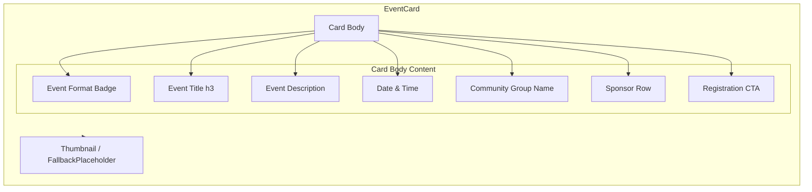

# Design Document: Event Card Component

## Overview

The Event Card Component (`EventCard`) is a React component that presents a rich, accessible card view of a community event. It replaces the current minimal card at `apps/web/components/calendar/event-card.tsx` with a full-featured design that includes thumbnail imagery, event format badges, sponsor attribution, a registration CTA with hover-reveal animation, and responsive/accessible behavior.

### Design Goals

- **Progressive disclosure** — surface key info immediately; reveal the registration CTA on hover (desktop) to create visual movement without cluttering the resting state.
- **Accessibility first** — semantic HTML, keyboard navigation, visible focus indicators, and `prefers-reduced-motion` support.
- **Reusability** — the component accepts data via props and renders deterministically, making it composable across pages (homepage, calendar, search results).
- **Consistency** — leverages existing project patterns (Tailwind CSS utility classes, dark mode via `dark:` variant, existing type system).

### Key Design Decisions

| Decision                                     | Rationale                                                                                                                                 |
| -------------------------------------------- | ----------------------------------------------------------------------------------------------------------------------------------------- |
| CSS-only hover reveal for CTA (no JS state)  | Reduces complexity, eliminates re-renders, works with `prefers-reduced-motion` via media query                                            |
| `useIsMobile` hook for mobile CTA visibility | The existing hook is already established in the project; CSS-only `:hover` doesn't reliably distinguish touch from pointer on all devices |
| `<article>` as root element                  | Semantic landmark for a self-contained piece of content per WAI-ARIA patterns                                                             |
| Tailwind `line-clamp` for truncation         | Built into Tailwind v4; no extra dependency needed; preserves full text in DOM for assistive tech                                         |
| Next.js `<Image>` for thumbnails             | Automatic lazy loading, responsive sizing, and format optimization already available in the project                                       |

---

## Architecture



### Component Tree

```
EventCard (article)
├── EventCardThumbnail
│   ├── Next/Image (when thumbnailUrl provided and loads)
│   └── FallbackPlaceholder (gradient/icon placeholder)
├── EventCardBody
│   ├── EventFormatBadge (conditional)
│   ├── h3 (title, line-clamp-2)
│   ├── p (description, line-clamp-3, conditional)
│   ├── EventCardMeta (date, time, group name)
│   ├── EventCardSponsors (conditional)
│   └── EventCardCTA (conditional, hover-reveal on desktop)
```

### State Management

The component is primarily stateless / presentational. The only stateful concern is:

1. **Thumbnail load error** — a local `useState<boolean>` tracks whether the `<Image>` `onError` fired to switch to the fallback.
2. **Mobile detection** — consumed from the existing `useIsMobile` hook to control CTA visibility class.

No global state, context, or side effects are needed.

---

## Components and Interfaces

### EventCard (main export)

```typescript
import type { Event } from '@/lib/types/event'

export type EventFormat = 'In-Person' | 'Virtual' | 'Hybrid'

export interface EventCardProps {
  /** Required event data object */
  event: Event
  /** Optional event format badge */
  eventFormat?: EventFormat
  /** Optional thumbnail image URL */
  thumbnailUrl?: string
}
```

### Internal Sub-components

These are not exported; they live inside the same file or a co-located module:

| Sub-component        | Props                                                   | Responsibility                                |
| -------------------- | ------------------------------------------------------- | --------------------------------------------- |
| `EventCardThumbnail` | `{ thumbnailUrl?: string; alt: string }`                | Renders image or fallback placeholder at 16:9 |
| `EventFormatBadge`   | `{ format: EventFormat }`                               | Colored badge/label                           |
| `EventCardMeta`      | `{ date: string; time: string; groupName: string }`     | Formatted date/time row                       |
| `EventCardSponsors`  | `{ sponsors: Sponsor[] }`                               | Sponsor logo row with links                   |
| `EventCardCTA`       | `{ registrationUrl: string; platform: SourcePlatform }` | Registration link with platform label         |

### Platform Display Name Mapping

```typescript
const platformDisplayName: Record<SourcePlatform, string> = {
  meetup: 'Meetup',
  eventbrite: 'Eventbrite',
  luma: 'Luma',
  discord: 'Discord',
  manual: 'External',
  other: 'External',
}
```

### Hover/CTA Animation Strategy

The CTA is positioned at the bottom of the card body. On desktop:

```css
/* Resting state — hidden below, zero opacity */
.event-card-cta {
  transform: translateY(8px);
  opacity: 0;
  transition:
    opacity 150ms ease,
    transform 150ms ease;
}

/* Revealed on card hover or focus-within */
.event-card:hover .event-card-cta,
.event-card:focus-within .event-card-cta {
  transform: translateY(0);
  opacity: 1;
}

/* Respects reduced motion */
@media (prefers-reduced-motion: reduce) {
  .event-card-cta {
    transition: none;
    opacity: 1;
    transform: none;
  }
}
```

In practice this is implemented with Tailwind utility classes:

- Card: `group` class
- CTA wrapper: `opacity-0 translate-y-2 transition-all duration-150 group-hover:opacity-100 group-hover:translate-y-0 group-focus-within:opacity-100 group-focus-within:translate-y-0 md:opacity-0 md:translate-y-2`
- Mobile override: on screens < 768px the CTA uses `opacity-100 translate-y-0` (always visible)
- Reduced motion: `motion-reduce:transition-none motion-reduce:opacity-100 motion-reduce:translate-y-0`

---

## Data Models

### Existing Types (no changes required)

The component consumes the existing `Event`, `Sponsor`, `CommunityGroup`, and `SourcePlatform` types unchanged.

```typescript
// From @/lib/types/event
export interface Event {
  id: string
  title: string
  description: string
  sponsors: Sponsor[]
  date: string // ISO date string "YYYY-MM-DD"
  time: string // Display string e.g. "6:30 PM - 9:00 PM EDT"
  location: string
  eventType: EventType
  registrationUrl: string
  sourcePlatform: SourcePlatform
  group: CommunityGroup
  tags: string[]
  featured: boolean
}
```

### New Types (added by this feature)

```typescript
/** Event format badge value — passed as an optional prop */
export type EventFormat = 'In-Person' | 'Virtual' | 'Hybrid'

/** Component props */
export interface EventCardProps {
  event: Event
  eventFormat?: EventFormat
  thumbnailUrl?: string
}
```

### Date Formatting

The `event.date` field is an ISO string (`"2026-06-22"`). The component will format it for display using `Intl.DateTimeFormat`:

```typescript
function formatEventDate(isoDate: string): string {
  return new Intl.DateTimeFormat('en-US', {
    weekday: 'long',
    month: 'long',
    day: 'numeric',
    year: 'numeric',
  }).format(new Date(isoDate + 'T00:00:00'))
}
```

The `event.time` field is already a display-ready string (e.g. `"6:30 PM - 9:00 PM EDT"`). The component extracts the start time portion (everything before the first `-` or the full string if no range) for the card display.

```typescript
function extractStartTime(timeStr: string): string {
  const dashIdx = timeStr.indexOf(' - ')
  return dashIdx > -1 ? timeStr.slice(0, dashIdx) : timeStr
}
```

---

## Correctness Properties

_A property is a characteristic or behavior that should hold true across all valid executions of a system — essentially, a formal statement about what the system should do. Properties serve as the bridge between human-readable specifications and machine-verifiable correctness guarantees._

### Property 1: Date formatting produces valid locale string

_For any_ valid ISO date string (format `YYYY-MM-DD` within the range 2000–2099), `formatEventDate` SHALL produce a string matching the pattern `"{Weekday}, {Month} {Day}, {Year}"` where Weekday is a full weekday name, Month is a full month name, Day is a 1–2 digit number, and Year is a 4-digit number.

**Validates: Requirements 1.3**

### Property 2: Start time extraction returns prefix before range separator

_For any_ time string containing `-` (a space-dash-space separator), `extractStartTime` SHALL return the substring before the first `-`. For any time string that does not contain `-`, it SHALL return the full input string unchanged.

**Validates: Requirements 1.4**

### Property 3: Platform display name mapping is total

_For any_ valid `SourcePlatform` value, `platformDisplayName` SHALL return a non-empty string. For `"manual"` and `"other"`, it SHALL return `"External"`. For all other platform values it SHALL return a capitalized platform name.

**Validates: Requirements 5.4, 7.4**

### Property 4: Semantic structure with title and group name

_For any_ valid Event object, the rendered EventCard SHALL contain: an `<article>` root element, an `<h3>` element whose text content equals the event title, and a text node containing the community group name.

**Validates: Requirements 1.1, 1.5, 7.3**

### Property 5: Text truncation preserves full content in DOM

_For any_ Event with a title of any length, the rendered `<h3>` element SHALL contain the complete title text in its `textContent` (not visually clipped by JS). For any Event with a non-empty description, the description element SHALL contain the complete description text in its `textContent`.

**Validates: Requirements 1.2, 9.1, 9.2, 9.4**

### Property 6: Sponsor rendering integrity

_For any_ Event with one or more sponsors: (a) each sponsor with a non-empty `logo` SHALL render an `` element whose `alt` attribute contains the sponsor name; (b) each sponsor without a logo SHALL render the sponsor name as text; (c) each sponsor with a non-empty `url` SHALL render within an `<a>` element that has `target="_blank"` and `rel="noopener noreferrer"`.

**Validates: Requirements 4.1, 4.2, 4.3, 4.5, 4.6**

### Property 7: Registration CTA rendering with accessible name

_For any_ Event with a non-empty `registrationUrl`, the rendered EventCard SHALL contain an `<a>` element whose `href` equals the `registrationUrl`, whose accessible name (via `aria-label` or visible text) matches `"Register on {platformDisplayName}"`, and which has `target="_blank"` and `rel="noopener noreferrer"`.

**Validates: Requirements 5.1, 5.2, 5.5, 7.4**

### Property 8: Thumbnail rendering with accessible alt

_For any_ non-empty `thumbnailUrl` prop provided to EventCard, the rendered output SHALL contain an image element whose accessible alt text includes the event title.

**Validates: Requirements 3.1, 3.5**

---

## Error Handling

| Scenario                                  | Behavior                                                                                                                                            |
| ----------------------------------------- | --------------------------------------------------------------------------------------------------------------------------------------------------- |
| Thumbnail image fails to load (`onError`) | Component catches the error via `onError` handler, sets local state to show fallback placeholder. No error propagation.                             |
| Empty `description`                       | Description paragraph is conditionally rendered; omitted when empty/falsy.                                                                          |
| Empty `registrationUrl`                   | CTA section is conditionally rendered; omitted when empty/falsy.                                                                                    |
| Empty `sponsors` array                    | Sponsors section is conditionally rendered; omitted when array is empty.                                                                            |
| Missing `eventFormat` prop                | Badge is conditionally rendered; omitted when undefined.                                                                                            |
| Missing `thumbnailUrl` prop               | Fallback placeholder renders in place of image.                                                                                                     |
| Invalid `date` string                     | `formatEventDate` wraps `Intl.DateTimeFormat` — if the date is malformed, it falls back to displaying the raw `event.date` string to avoid a crash. |
| Missing `group.logo`                      | Group logo is not rendered in this component (out of scope per requirements); no error condition.                                                   |

---

## Testing Strategy

### Test Framework & Configuration

- **Framework:** Vitest + React Testing Library (already configured)
- **Environment:** jsdom (configured in `vitest.config.ts`)
- **Property-based testing:** `fast-check` library for generating random inputs
- **Location:** `apps/web/__tests__/components/calendar/event-card.test.tsx`

### Unit Tests (Example-Based)

| Test                                                   | Validates |
| ------------------------------------------------------ | --------- |
| Renders without errors with only required `event` prop | 10.4      |
| Displays fallback placeholder when no `thumbnailUrl`   | 3.2       |
| Displays fallback on image load error                  | 3.3       |
| Hides description when empty                           | 1.6       |
| Hides CTA when `registrationUrl` is empty              | 5.3       |
| Hides sponsors section when sponsors array is empty    | 4.4       |
| Hides format badge when `eventFormat` not provided     | 2.3       |
| Displays each format badge value correctly             | 2.1, 2.2  |
| CTA has animation classes on desktop                   | 5.6, 8.2  |
| CTA is visible on mobile                               | 5.7       |
| Motion-reduce classes applied to animated elements     | 8.6       |
| Interactive elements have focus ring classes           | 7.2, 8.4  |
| Card hover state classes present                       | 8.1       |
| Transition duration ≤ 200ms                            | 8.7       |

### Property-Based Tests (fast-check)

Each property from the Correctness Properties section is implemented as a single property-based test with a minimum of 100 iterations.

| Property Test                     | Tag                                                                                                    |
| --------------------------------- | ------------------------------------------------------------------------------------------------------ |
| Date formatting                   | Feature: event-card-component, Property 1: Date formatting produces valid locale string                |
| Start time extraction             | Feature: event-card-component, Property 2: Start time extraction returns prefix before range separator |
| Platform display name mapping     | Feature: event-card-component, Property 3: Platform display name mapping is total                      |
| Semantic structure                | Feature: event-card-component, Property 4: Semantic structure with title and group name                |
| Text truncation preserves content | Feature: event-card-component, Property 5: Text truncation preserves full content in DOM               |
| Sponsor rendering                 | Feature: event-card-component, Property 6: Sponsor rendering integrity                                 |
| CTA rendering                     | Feature: event-card-component, Property 7: Registration CTA rendering with accessible name             |
| Thumbnail rendering               | Feature: event-card-component, Property 8: Thumbnail rendering with accessible alt                     |

### Testing Dependencies

The project already has `vitest`, `@testing-library/react`, and `jsdom`. The only new dev dependency needed is:

```bash
pnpm add -D fast-check --filter @odevs/web
```

### Test Configuration

Each property test runs with `fc.assert(fc.property(...), { numRuns: 100 })` minimum.

### Coverage Goals

- All 8 correctness properties validated via PBT
- All conditional rendering paths covered by example-based unit tests
- Accessibility attributes verified in both PBT and unit tests
